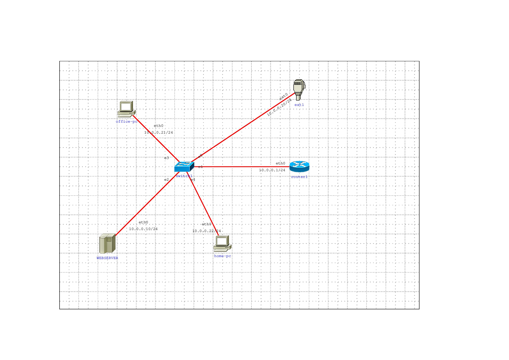
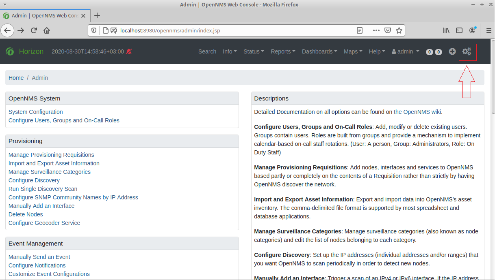
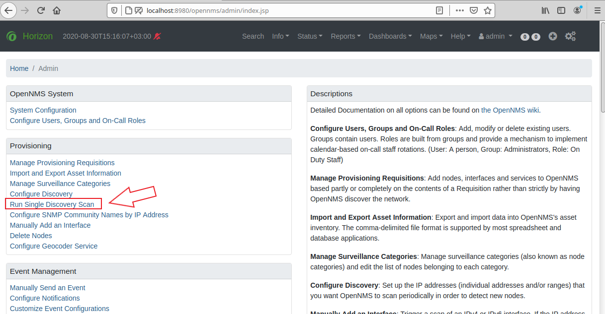
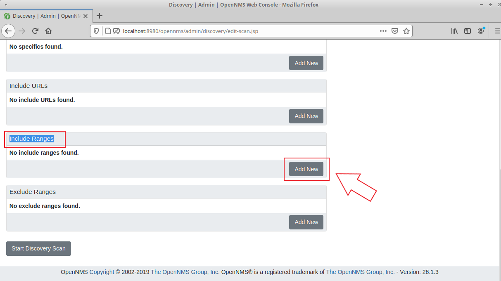
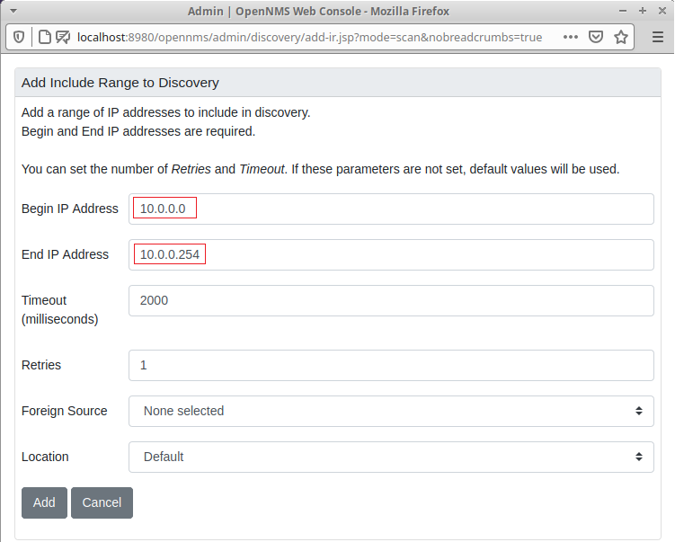
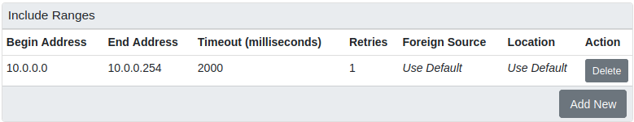
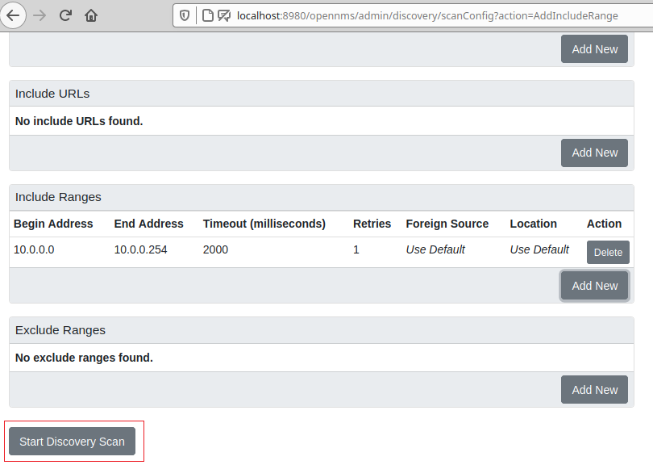
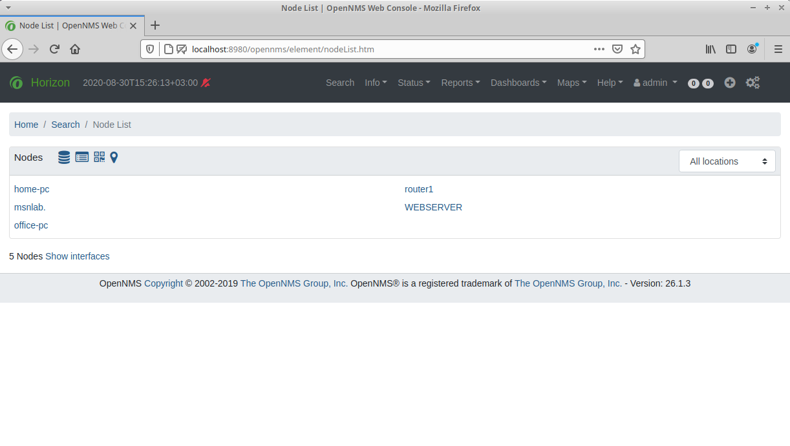
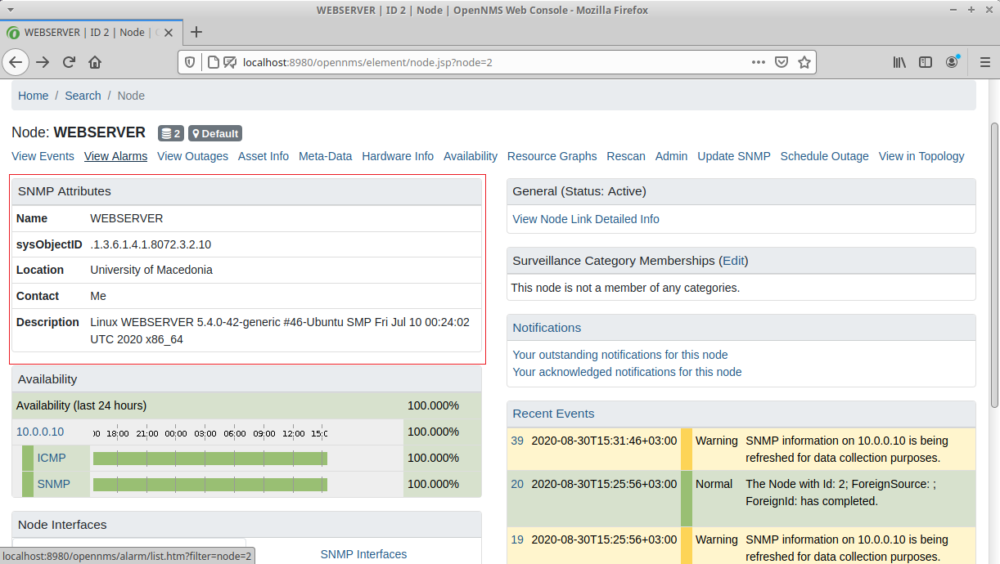
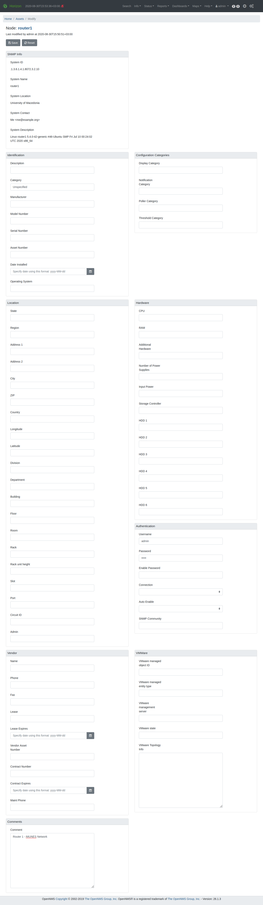

## Description

[```OpenNMS```](https://www.opennms.com/) is a free and open-source enterprise grade network monitoring and network management platform. In this project we will use the OpenNMS Discovery Scan in order to discover nodes in our emulated IMUNES network. We will be utilizing the SNMP protocol in order to retrieve additional data for each disovered node.


[```IMUNES```](http://imunes.net/) is a kernel based network emulator / simulator. IMUNES provides a general purpose IP network emulation/simulation architecture for real-time large scale experiments and uses [```Quagga```](https://www.quagga.net/). Quagga is a network routing software suite. Each IMUNES emulated network node runs inside a docker ```container```. The docker ```image``` used for each container is purpose is [```imunes/template```](https://hub.docker.com/r/imunes/template).

This document provides the necessary steps to:
- install IMUNES
- modify the ```imunes/template``` docker image
- configure Quagga with SNMP support
- configure SNMP service
- install and configure OpenNMS
- create an experimental/test IMUNES network
- use OpenNMS' Discovery Scan feature to scan the experimental network created on IMUNES

## Installation Environment

A *Xubuntu 20.04.1 LTS (Focal Fossa) 64-bit* virtual machine was used for this project. In this VM, the root account is ```user``` and the hostname is ```msnlab```.


## IMUNES Installation
First and foremost, lets update and/or upgrade any system packages.

```console
user@msnlab:~$ sudo apt update && sudo apt dist-upgrade -y
```

Install IMUNES dependencies.
```console
user@msnlab:~$ sudo apt install git openvswitch-switch docker.io xterm wireshark make imagemagick tk tcllib util-linux
```

Clone IMUNES source code from GitHub and change to the ```imunes/``` directory.
```console
user@msnlab:~$ git clone https://github.com/imunes/imunes.git && cd imunes/
```
Run ```sudo make install``` in order to install IMUNES.
```console
user@msnlab:~/imunes$ sudo make install
```

Next, initialize IMUNES. The ```-p``` parameter tells IMUNES to prepare the *virtual root file system* and download the default ```imunes/template``` docker image.

```console
user@msnlab:~$ sudo imunes -p
```

Now, IMUNES can be run with:
```console
user@msnlab:~$ sudo imunes
```

At this point IMUNES installation has been completed and the next step is to configure Quagga to support the SNMP protocol.

## Alternative

In case you don't want to waste your time configuring and installing everything on your own just to get an SNMP enabled docker image for IMUNES, there is a solution to that.

Just download the pre-configured docker image from this very repository packages at https://github.com/iamaldi/imunes-snmp/packages/373676?version=latest

## Modification of ```imunes/template``` docker image
Confirm that there is a local copy of the ```imunes/template``` docker image
```console
user@msnlab:~$ sudo docker image ls
REPOSITORY          TAG         IMAGE ID            CREATED SIZE
imunes/template     latest      28ab347bef71        934MB
```

Start a docker container from the image:
```console
user@msnlab:~$ sudo docker run --detach --tty --net='host' imunes/template
```

The parameter ```--net='host'``` provides internet access to the container through the host system. The container needs internet access to install additional required software dependencies. This is achieved 

Confirm that the ```container``` was created successfully:
```console
user@msnlab:~$ sudo docker container ls
CONTAINER ID        IMAGE               COMMAND             CREATED             STATUS              PORTS               NAMES
d3cdf12c8d50        c009531c75fd        "/bin/bash"         10 seconds ago      Up 10 seconds                             clever_babbage
```

By running the above command we should get the ```CONTAINER-ID```. This information is necessary in order to gain access to the ```container```.

Access the ```container's``` shell:
```console
user@msnlab:~$ sudo docker exec -u root -t -i d3cdf12c8d50 /bin/bash
root@msnlab:~#
```

## Quagga Configuration with SNMP Support

Install any updates and/or upgrades inside the container:
```console
root@msnlab:~# apt update && apt dist-upgrade -y 
```

Install all the required dependencies:
```console
root@msnlab:/# apt install git make snmp snmpd snmptrapd snmp-mibs-downloader automake autoconf libtool texinfo gawk pkg-config libreadline-dev libc-ares-dev libsnmp-dev
```
 
Clone Quagga's source code from the repository and change to the ```quagga/``` folder: 
```console
root@msnlab:/# git clone https://git.savannah.gnu.org/git/quagga.git && cd quagga/
```

Set the ```LD_LIBRARY_PATH``` environment variable in order to let the compiler know that the libraries on this ```container``` can be found under ```/usr/local/lib```:
```console
root@msnlab:/quagga# export LD_LIBRARY_PATH=$LD_LIBRARY_PATH:/usr/local/lib
```

Based on the installation steps from [INSTALL.quagga.txt](http://git.savannah.gnu.org/cgit/quagga.git/tree/INSTALL.quagga.txt), run the following commands in order to initialize the required installation files.
```console
root@msnlab:/quagga# automake --add-missing
root@msnlab:/quagga# ./bootstrap.sh
```

Add the ```LDFLAGS``` environment variable to let ```Quagga``` know that linker libraries can be found under ```/usr/local/lib``` and run ```ldconfig```.
```console
root@msnlab:/quagga# export LDFLAGS='-L/usr/local/lib' && ldconfig
```

Configure Quagga to use the ```SNMP``` protocol and run as user ```root``` and read the configuration files from ```/etc/quagga/```.
```console
root@msnlab:/quagga# ./configure --enable-snmp=agentx --enable-user=root --enable-group=root --sysconfdir=/etc/quagga
```

After the configuration is completed, install Quagga by running:
```console
root@msnlab:/quagga# make install
```

 > In case Quagga installation ```fails``` it may be due to incorrect linker libraries. Make sure to set the LD_LIBRARY_PATH and LDFLAGS environment variables correctly and retry the installation.

## SNMP Service Configuration

Open and edit the SNMP configuration file  ```/etc/snmp/snmpd.conf``` with ```nano```:
```console
root@msnlab:/quagga# nano /etc/snmp/snmpd.conf
```

Comment out the following lines:
- agentAddress  udp:127.0.0.1:161
- extend    test1
- extend-sh test2

Modify the default value of ```'sysLocation'``` to:
- sysLocation       University of Macedonia

At the bottom of the file, after line ```'master agentx'``` add the following:
- agentXSocket /var/agentx/master
- agentXPerms 777 777

We're basically telling SNMP to run under the ```/var/agentx/master``` socket.

Next, edit the SNMP daemon configuration file ```'/etc/default/snmpd'```.
```console
root@msnlab:/quagga# nano /etc/default/snmpd
```

Comment out the following field:
- export MIBS=

Change ```SNMPDOPTS``` to the following:
- SNMPDOPTS='-Lsd -Lf /tmp/snmpd.log -u root -g root -I -agentx -p /var/run/snmpd.pid -c /etc/snmp/snmpd.conf'

We configure the SNMP daemon to keep logs under ```/tmp/snmpd.log```, run as user ```root``` and use the configuration under ```/etc/snmp/snmpd.conf```.

Configure the SNMP service to start automatically on every docker container startup.

On the ```/etc/bash.bashrc``` file add the following lines:
```console
root@msnlab:/quagga# nano /etc/bash.bashrc
```

- \#Enable SNMP service on start-up
- /usr/sbin/service snmpd start

Restart the SNMP service.
```console
root@msnlab:/quagga# service snmpd restart
```

If everything has been configured correcty, by running ```snmpwalk -v 1 -c public 127.0.0.1``` the SNMP service should respond with plenty of data.

Breaking down the SNMPWalk command:
- the ```-v 1``` parameter is the SNMP service used
- ```-c public``` is the community string and a reference to it can be found on ```/etc/snmp/snmpd.conf```
- ```127.0.0.1``` is the IP address of the SNMP service that we're trying to reach and retrieve SNMP data from.

```console
root@msnlab:/quagga# snmpwalk -v 1 -c public 127.0.0.1
iso.3.6.1.2.1.1.1.0 = STRING: "Linux msnlab 5.4.0-42-generic #46-Ubuntu SMP Fri Jul 10 00:24:02 UTC 2020 x86_64"
iso.3.6.1.2.1.1.2.0 = OID: iso.3.6.1.4.1.8072.3.2.10
iso.3.6.1.2.1.1.3.0 = Timeticks: (8074890) 22:25:48.90
iso.3.6.1.2.1.1.4.0 = STRING: "Me <me@example.org>"
iso.3.6.1.2.1.1.5.0 = STRING: "msnlab"
iso.3.6.1.2.1.1.6.0 = STRING: "University of Macedonia"
iso.3.6.1.2.1.1.7.0 = INTEGER: 72
iso.3.6.1.2.1.1.8.0 = Timeticks: (0) 0:00:00.00
iso.3.6.1.2.1.1.9.1.2.1 = OID: iso.3.6.1.6.3.11.3.1.1
iso.3.6.1.2.1.1.9.1.2.2 = OID: iso.3.6.1.6.3.15.2.1.1
iso.3.6.1.2.1.1.9.1.2.3 = OID: iso.3.6.1.6.3.10.3.1.1
iso.3.6.1.2.1.1.9.1.2.4 = OID: iso.3.6.1.6.3.1
iso.3.6.1.2.1.1.9.1.2.5 = OID: iso.3.6.1.6.3.16.2.2.1
iso.3.6.1.2.1.1.9.1.2.6 = OID: iso.3.6.1.2.1.49
iso.3.6.1.2.1.1.9.1.2.7 = OID: iso.3.6.1.2.1.4
iso.3.6.1.2.1.1.9.1.2.8 = OID: iso.3.6.1.2.1.50
iso.3.6.1.2.1.1.9.1.2.9 = OID: iso.3.6.1.6.3.13.3.1.3
iso.3.6.1.2.1.1.9.1.2.10 = OID: iso.3.6.1.2.1.92
iso.3.6.1.2.1.1.9.1.3.1 = STRING: "The MIB for Message Processing and Dispatching."
iso.3.6.1.2.1.1.9.1.3.2 = STRING: "The management information definitions for the SNMP User-based Security Model."
iso.3.6.1.2.1.1.9.1.3.3 = STRING: "The SNMP Management Architecture MIB."
iso.3.6.1.2.1.1.9.1.3.4 = STRING: "The MIB module for SNMPv2 entities"
iso.3.6.1.2.1.1.9.1.3.5 = STRING: "View-based Access Control Model for SNMP."
iso.3.6.1.2.1.1.9.1.3.6 = STRING: "The MIB module for managing TCP implementations"
iso.3.6.1.2.1.1.9.1.3.7 = STRING: "The MIB module for managing IP and ICMP implementations"
iso.3.6.1.2.1.1.9.1.3.8 = STRING: "The MIB module for managing UDP implementations"
iso.3.6.1.2.1.1.9.1.3.9 = STRING: "The MIB modules for managing SNMP Notification, plus filtering."
iso.3.6.1.2.1.1.9.1.3.10 = STRING: "The MIB module for logging SNMP Notifications."
iso.3.6.1.2.1.1.9.1.4.1 = Timeticks: (0) 0:00:00.00
iso.3.6.1.2.1.1.9.1.4.2 = Timeticks: (0) 0:00:00.00
iso.3.6.1.2.1.1.9.1.4.3 = Timeticks: (0) 0:00:00.00
iso.3.6.1.2.1.1.9.1.4.4 = Timeticks: (0) 0:00:00.00
iso.3.6.1.2.1.1.9.1.4.5 = Timeticks: (0) 0:00:00.00
iso.3.6.1.2.1.1.9.1.4.6 = Timeticks: (0) 0:00:00.00
iso.3.6.1.2.1.1.9.1.4.7 = Timeticks: (0) 0:00:00.00
iso.3.6.1.2.1.1.9.1.4.8 = Timeticks: (0) 0:00:00.00
iso.3.6.1.2.1.1.9.1.4.9 = Timeticks: (0) 0:00:00.00
iso.3.6.1.2.1.1.9.1.4.10 = Timeticks: (0) 0:00:00.00
iso.3.6.1.2.1.25.1.1.0 = Timeticks: (42810291) 4 days, 22:55:02.91
iso.3.6.1.2.1.25.1.2.0 = Hex-STRING: 07 E4 08 1A 10 02 1C 00 2B 00 00 
iso.3.6.1.2.1.25.1.3.0 = INTEGER: 393216
iso.3.6.1.2.1.25.1.4.0 = STRING: "BOOT_IMAGE=/boot/vmlinuz-5.4.0-42-generic root=UUID=08550881-62ca-4260-98c1-dad2b7f21ed9 ro quiet splash
"
iso.3.6.1.2.1.25.1.5.0 = Gauge32: 0
iso.3.6.1.2.1.25.1.6.0 = Gauge32: 4
iso.3.6.1.2.1.25.1.7.0 = INTEGER: 0
End of MIB
```

## Save changes to the ```imunes/template``` docker image

Exit the docker container.
```console
root@msnlab:/quagga# exit
```

Save the changes made to the container on the ```imunes/template``` docker image.
```console
user@msnlab:~$ sudo docker commit d3cdf12c8d50 imunes/template:latest
```

With that done, now every node on an IMUNES network will be pre-configured with SNMP support.

## OpenNMS Installation & Configuration

OpenNMS installation is straight forward and a guide is available at https://docs.opennms.org/opennms/branches/develop/guide-install/guide-install.html#_installing_on_debian

Install Java OpenJDK 11.
```console
user@msnlab:~$ sudo apt install openjdk-11-jdk
```

Following the installation guide, add the following repositories.
```console
user@msnlab:~$ sudo cat << EOF | sudo tee /etc/apt/sources.list.d/opennms.list
> deb https://debian.opennms.org stable main
> deb-src https://debian.opennms.org stable main
> EOF
user@msnlab:~$ wget -O - https://debian.opennms.org/OPENNMS-GPG-KEY | sudo apt-key add -
user@msnlab:~$ sudo add-apt-repository ppa:willat8/shepherd
user@msnlab:~$ sudo apt-get update
```

Install OpenNMS
```console
user@msnlab:~$ sudo apt-get -y install opennms
```

After the installation is done, let's configure the PostgreSQL service.

Start the PostgreSQL service.
```console
user@msnlab:~$ sudo systemctl start postgresql
```

Change to the ```postgresql``` user.
```console
user@msnlab:~$ sudo su postgress
```

As ```postgresql```, with the ```createuser``` and ```createdb``` commands add a new user and create a new database with the name ```opennms```.
```console
postgres@msnlab:/home/user$ createuser -P opennms
Enter password for new role: 
Enter it again: 
postgres@msnlab:/home/user$ createdb -O opennms opennms
```

Change the default password of the database user ```postgres``` and exit the user shell with ```exit```.
```console
postgres@msnlab:/home/user$ psql -c "ALTER USER postgres WITH PASSWORD 'msnlabsecretpass';"
postgres@msnlab:/home/user$ exit
user@msnlab:~$
```

Now that the password has been changed, update the OpenNMS configuration file ```/etc/opennms/opennms-datasources.xml``` with the new values.
```console
user@msnlab:~$ sudo nano /etc/opennms/opennms-datasources.xml
```

The contents of the file should look like the following.
```xml
<jdbc-data-source name="opennms"
                    database-name="opennms"
                    class-name="org.postgresql.Driver"
                    url="jdbc:postgresql://localhost:5432/opennms"
                    user-name="opennms"
                    password="opennms" />

<jdbc-data-source name="opennms-admin"
                    database-name="template1"
                    class-name="org.postgresql.Driver"
                    url="jdbc:postgresql://localhost:5432/template1"
                    user-name="postgres"
                    password="msnlabsecretpass" />
```

Update OpenNMS configuration with the Java path.
```console
user@msnlab:~$ sudo /usr/share/opennms/bin/runjava -s
```

Initialize the PostgreSQL database, detect any system libraries and save the results in the configuration.
```console
user@msnlab:~$ sudo /usr/share/opennms/bin/install -dis
```

Configure the OpenNMS service to start automatically.
```console
user@msnlab:~$ sudo systemctl enable opennms
```

Start the service manually for the first time.
```console
user@msnlab:~$ sudo systemctl start opennms
```

The dashboard should be now accessible at http://localhost:8980/opennms.

Login with the default credentials ```admin/admin``` and change the password.

## Creating an experimental network on IMUNES

Run IMUNES.
```console
user@msnlab:~$ sudo imunes
```

Create the following network experiment and run it from the menu options ```Experiment``` -> ```Execute```. You can download this experiment from [here](imunes-test-net.imn).


The experiment network is comprised of two hosts ```office-pc``` & ```home-pc```, and a web server namely ```WEBSERVER```. This whole network is exposed on the ```10.0.0.0/24``` subnet.

## IMUNES node discovery via OpenNMS Single Discovery Scan

In order to obtain information regarding the experiment network via SNMP, the following steps should be followed.

- Navigate to the OpenNMS dashboard, http://localhost:8980/opennms
- From the upper-right menu options, click on the ```Configure OpenNMS``` gear icon or navigate via a direct link at http://localhost:8980/opennms/admin/index.jsp 
- Under the menu ```Provisioning``` select ```Run Single Discovery Scan``` or direct link at http://localhost:8980/opennms/admin/discovery/edit-scan.jsp 
- On Single Discovery Scan options, under ```Include Ranges``` click ```Add New```. 
- On the pop-up window, under ```Begin IP Address``` insert the following IP address ```10.0.0.0``` and under ```End IP Address``` insert the IP address ```10.0.0.254``` and then click ```Add```. 
- The IP address range entered on the previous step should be now visible like the following. 
- Click ```Start Discovery Scan```  in order for the discovery scan to begin.

Scan results will be available after a few minutes since OpenNMS needs to search the whole address space that we provided in the IP address range.

During a discovery scan, OpenNMS adds each new node under ```Info -> Nodes```. The Nodes list can also be accessed directly at http://localhost:8980/opennms/element/nodeList.htm


As we see in the previous image, OpenNMS is able to discover all the nodes of the emulated experiment IMUNES network based on the provided IP address range.

In order to view detailed information regarding each node, simply click on its name. For example, let's explore the ```WEBSERVER``` node.


Notice that OpenNMS utilized the SNMP protocol in order to gather information regarding each node. Such information is avaiilable under ```SNMP Attributes```.

```Availability``` also shows the other services that OpenNMS was able to detect and also their availability. For example, in case one of these detected services goes offline, OpenNMS will log and notify of the event.


OpenNMS allows for the organization of nodes in groups for easier management. Additionally, it offers the ability to add and update node information. This information includes attributes from the hardware used to the physical location of the asset. This data can help understand the network topologies and offers an easier asset management of an organization.


